<h1 class="project-name">{{ page.title | default: site.title }}</h1>
[description]

# Darts Score App

Учебный проект по разработке мобильного приложения под iOS: 
- целевая версия iOS: 16.0
- устройство, на котором тестировалось приложение: iPhone 13 Pro Max (iOS 16.6 v)

## Суть приложения

Набрать как можно больше очков, правильно отвечая на вопросы о том, сколько очков выбито на мишени для дартса тремя дротиками.

Приложение разделено на 3 раздела:
- Игра
- Статистика
- Настройки

<h3 style="text-align: center;">Раздел "Игра"</h3>
<h4 style="text-align: center;">1. Перед началом игры</h4>

    
При запуске приложения, по умолчанию открывается раздел <b>"Игра"</b>. Перед запуском новой игры пользователь видит следующую информацию:
 
    <ol>
        <li>сколько всего попыток ответить правильно у него имеется;</li>
        <li>сколько секунд дается, чтобы ответить в каждой попытке;</li>
    </ol>
    
Также пользователю отображается мишень для дартса, в котором будут показаны расположения дротиков - результаты попаданий при каждой попытке.

    
При нажатии на кнопку <b>"НАЧАТЬ"</b> начинается сама игра.

    

    

        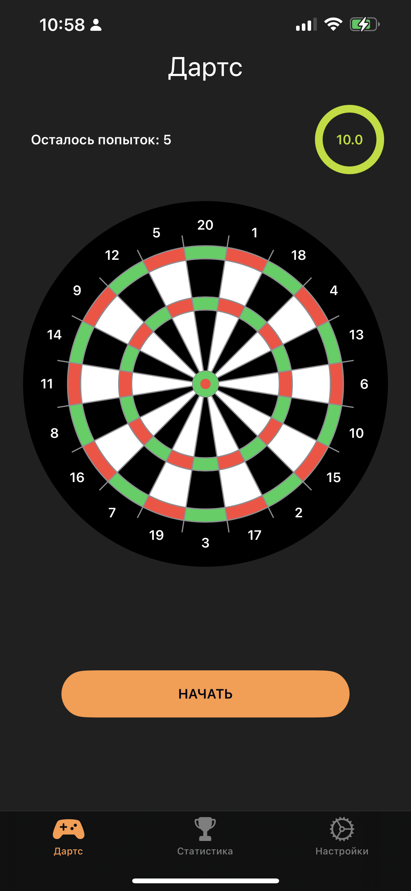
    

    

<h4 style="text-align: center;">2. В процессе игры</h4>

    
После нажатия на кнопку <b>"НАЧАТЬ"</b> пользователю отображаются изображения дротиков, расположенные на мишени по случайному образу. Таймер начинает обратный отчет (в секундах).
 
    
Под мишенью отображается вопрос на который нужно правильно ответить, выбрав один и вариантов ответа.
 
    
Количество очков - это сумма очков, которые "выбиты" дротикками на мишени. Каждый дротик может попасть в любой очковый сектор, а также возможен промах - когда дротик попал в черную зону, где уже расположены числа с очками (после второго красно-зеленого ряда, если считать от центра). Необходимо рассматривать именно наконечник дротика для того, чтобы рассчитать сумму "выбитых очков" очков.

    
При нажатии на любой из предложенных ответов (круглая кнопка бирюзового цвета с количеством очков), мишень делает 1 оборот вокруг своей оси, генерируются новые "попадания" дротиков и обновляются значения в кнопках для ответа. Также уменьшается количество попыток и перезапускается таймер

    
Если пользователь не успевает ответить за отведенное время, то приложение самостоятельно обновляет все данные, а попытка засчитывается как пропущенная. Если пользователь успел ответить, то, в зависимости от того правильно он ответил или нет, попытка засчитывается как правильная или ошибочная, и пользователь получает баллы или нет.
 

    

    

        

            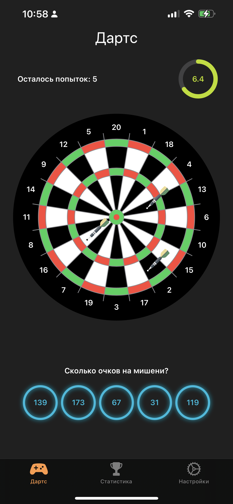
        

        

            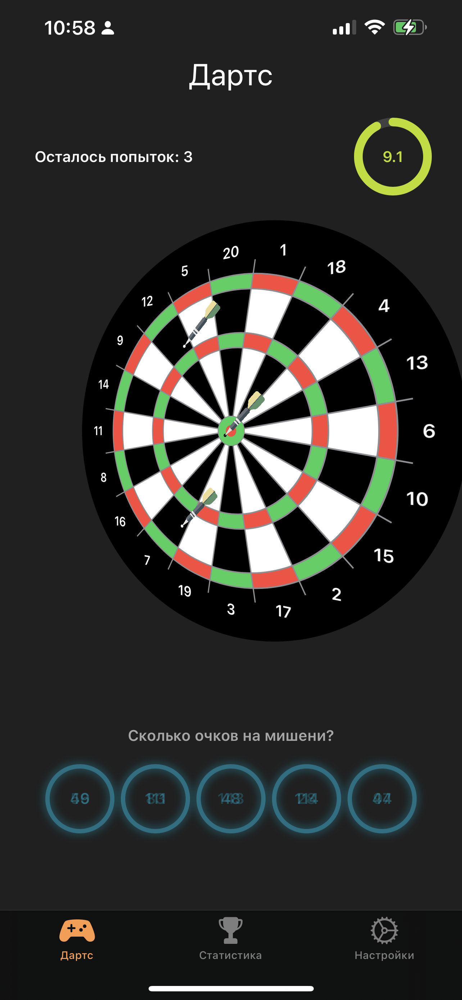
        

    

    

<h4 style="text-align: center;">3. Пауза и конец игры<</h4>

    
Если пользователь в процессе игры перешел на другой раздел (<b>"Статистика"</b> или <b>"Настройки"</b>), то игра приостанавливается и сбрасывается до текущей попытки. То есть сохраняется прогресс игры.
 
    
При возвращении в раздел <b>"Игра"</b> будет сброшен таймер, и отображены 2 кнопки:

    <ol>
        <li><b>"ПРОДОЛЖИТЬ"</b> - чтобы загрузить сохраненный прогресс начатой игры и продолжить ее.</li>
        <li><b>"ЗАНОВО"</b> - чтобы удалить сохраненный прогресс игры и перейти в начальное сотояние раздела - перед началом игры (см. первый скриншот).</li>
    </ol> 
    
После того как пользователь ответит на последнюю попытку (или истечет время) то выведется краткая информация о текущей игре - результаты. На попупрозрачной вьюшке будет отображено:

    <ol>
        <li>количество попыток;</li>
        <li>количество правильных ответов;</li>
        <li>количество неправильных ответов;</li>
        <li>количество пропущенных попыток (истекло время);</li>
        <li>количество набранных очков за ответы;</li>
        <li>количество общее потраченное время на все ответы;</li>
    </ol>
    
В дополнение к этому в течении 20-30 секунд будет озвучена мелодия, разная для хорошего и плохого результата. Плохим будет считаться результат, когда количество неправильных ответов будет больше половины всех попыток.
 

    

    

        

            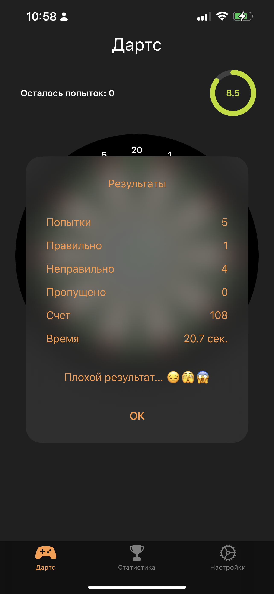
        

        

            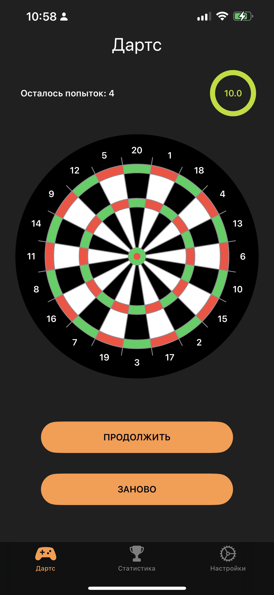
        

    

    

<h3 style="text-align: center;">Раздел "Статистика"</h3>
<h4 style="text-align: center;">1. История игр<</h4>

    
При переходе в данный раздел в самом начале отображается таблица с краткой статистикой проведенных игр. Таблица содержит следующие колонки:
 
    <ol>
        <li><b>"Счет"</b> - количество очков, набранных в процессе ответов</li>
        <li><b>"Попытки"</b> - количество правильных ответов и количество попыток всего</li>
        <li><b>"Время"</b> - общее время (в секкундак), потраченное на все попытки</li>
    </ol>
    
Все записи отсортированы в порядке убывания по количеству набранных очков.

    
Дополнительно наложен градиент: <b>ЗЕЛЕНЫЙ-ЖЕЛТЫЙ-КРАСНЫЙ</b>.

    
Каждая запись кликабельна, и, при нажатии на любую запись, будет выполнен переход на подраздел <b>"История ответов"</b>

    

    

        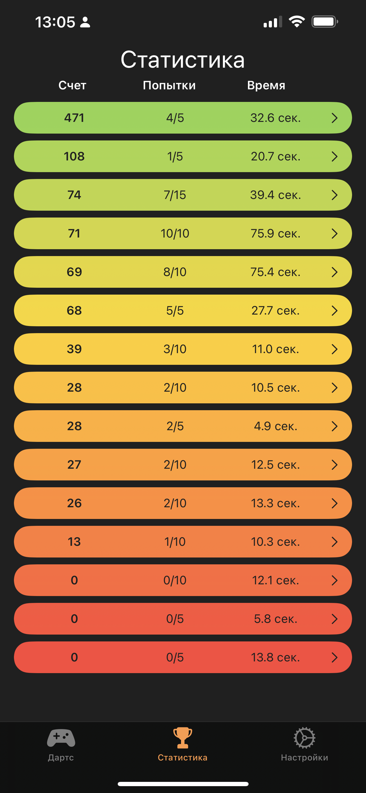
    

    

<h4 style="text-align: center;">2. История ответов<</h4>

    
В данном подразделе отображаются вся информация по конкретной попытке в данной игре (игра - запись, которую выбрал пользователь в разделе <b>"Статистика"</b>):
 
    <ol>
        <li>мишень для дартса и дротики с расположениями</li>
        <li>варианты ответов с количествами "выбитых" очков дротиками</li>
        <li>правильный ответ (отображается светло-зеленым цветом)</li>
        <li>неправильный ответ пользователя (отображается светло-красным цветом)</li>
    </ol>
    
Неправильный ответ отображется только если пользователь ответил неправильно. В остальных случаях отображается правильный ответ и все остальные (бирюзового цвета).
 
    
Чтобы просмотреть, информацию о других попытках пользователю нужно только свайпнуть в сторону (вправо или влево).

    

    

        

            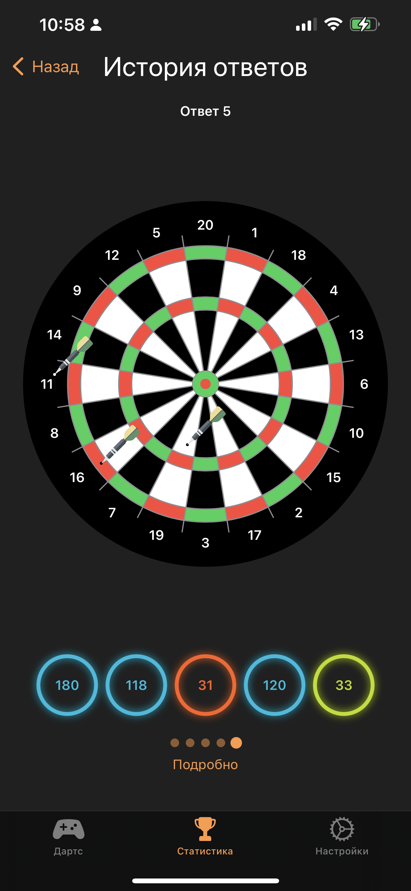
        

        

            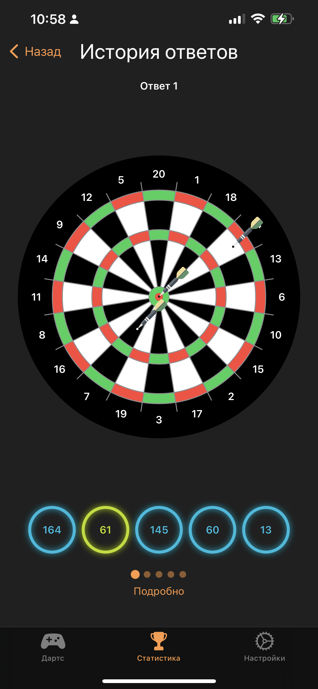
        

    

    

<h4 style="text-align: center;">3. Подробная статистика<</h4>

    
При нажатии на кнопку "Подробно", снизу на половину экрана появится "шторка" - детальная информация об игре и конкретных ответах пользователя.
 
    
Блок оранжевой информации показывает какие настройки были выбраны для данной игры и общую статистику по игре:
 
    <ol>
        <li>количество очков, набранных пользователем за всю игру;</li>
        <li>время, затраченное на все ответы;</li>
        <li>количество всех попыток на то, чтобы ответить правильно;</li>
        <li>количество правильных ответов;</li>
        <li>количество попыток, на которые пользователь не успел ответить;</li>
        <li>дата - когда была сыграна игра.</li>
    </ol> 
    
Ниже перечислены блоки с информацией о каждой попытке:

    <ol>
        <li>сектор, в который попал конкретный дротик;</li>
        <li>количество очков, выбитых каждым дротиком по отдельности;</li>
        <li>какой ответ дал пользователь;</li>
        <li>сколько времени пользователь потратил на эту попытку;</li>
        <li>сколько очков пользователь получил за эту попытку;</li>
    </ol>
    
Пояснения к записям напротив строк "Попадание 1-3":
 
    <ol>
        <li>"20х1" = 20 очков: дротик попал в сектор 20 с множителем 1 (цвет черный).</li>
        <li>"20х2" = 40 очков: дротик попал в сектор 20 с множителем 2 (цвет зеленый, узкое кольцо наибольшего диаметра).</li>
        <li>"20х3" = 40 очков: дротик попал в сектор 20 с множителем 3 (цвет зеленый, узкое кольцо среднего диаметра).</li>
        <li>"25х1" = 25 очков: дротик попал в сектор 25 (цвет зеленый, наименьшее кольцо, окружающее красный центр).</li>
        <li>"50х1" = 50 очков: дротик попал в сектор 50 (цвет красный, в яблочко).</li>
        <li>"Промах" = 0 очков: дротик попал в мишень за пределы очковой зоны (цвет черный).</li>
    </ol>

    

    

        

            
        

        

            
        

        

            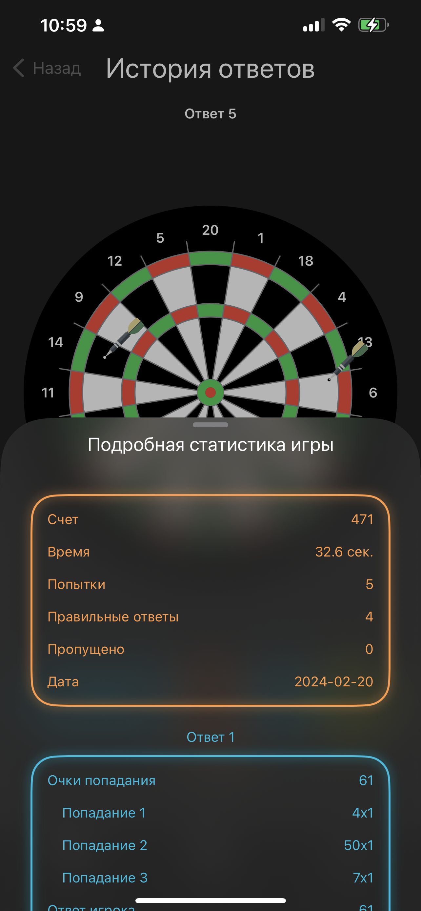
        

    

    

<h3 style="text-align: center;">Раздел "Настройки"</h3>
<h4 style="text-align: center;">1. Общие настройки<</h4>

    
В разделе "Настройки" пользователь может выполнить следующие действия:
 
    <ol>
        <li>изменить количество попыток в игре;</li>
        <li>изменить время, которое дается на каждую попытку;</li>
        <li>перейти в настройки внешнего вида;</li>
        <li>перейти в настройки звуковых эфектов;</li>
    </ol>
    
Все настройки, изменяемые пользователем, сохраняеются глобально и при перезапуске не теряются. Стоит обратить внимание, что настройки конкретной игры сериализуются вместе со статистикой самой игры, и поэтому измененные настройки будут применены только с началом новой игры.

    

    

        

            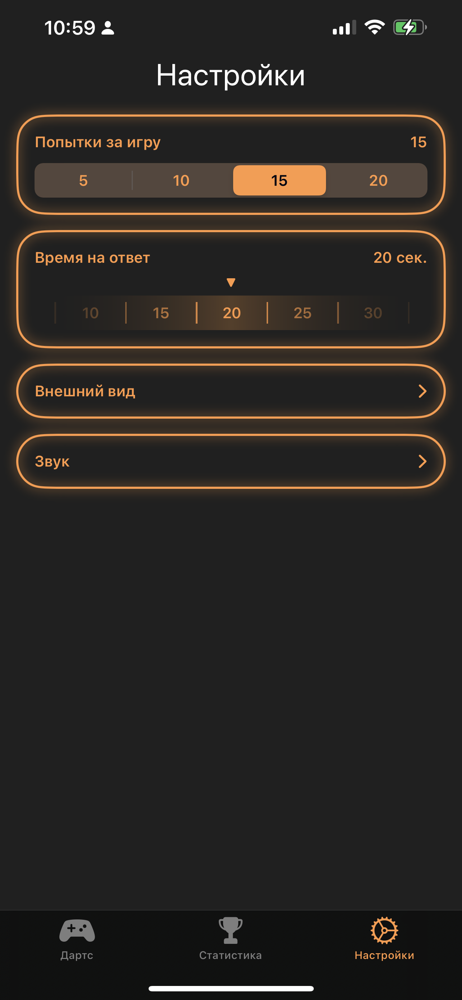
        

        

            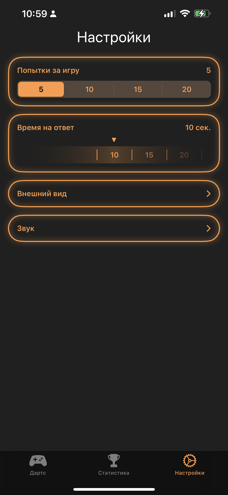
        

    

    

<h4 style="text-align: center;">2. Настройки внешнего вида<</h4>

    
Данный подраздел предназначен для того, чтобы пользователь мог настройить то, как будут отображаться мишень и дротики во время игры и при просмотре статистики. Есть такие опции как:
 
    <ol>
        <li>выбрать понравившееся изображение дротика из предложенных;</li>
        <li>изменить размер дротика;</li>
        <li>включить или выключить возможность промахов;</li>
    </ol>
    
При изменении каждой настройки, отображаемая представление мишени и дротиков будет обновляться.
 
    
Переключатель промахов намеренно добавлен именно в этот раздел, чтобы пользователю нагляд было продемонстрированно, что изменяет данная настройка.

    

    

        

            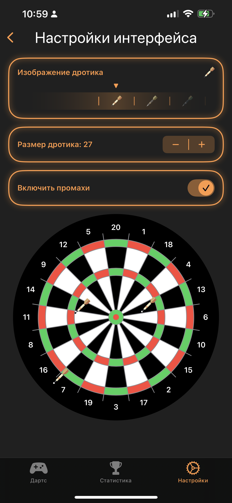
        

        

            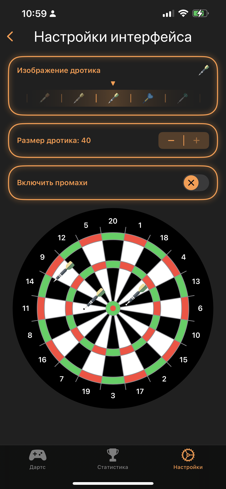
        

    

    

<h4 style="text-align: center;">3. Звуковые настройки<</h4>

    
Этот подраздел предназначен для управления громкостью звуковых эффектов с помощью ползунка.

    
При необходимости можно отключить конкретную мелодию или звуковой эффект.

    
При изменении громкости звука обновляется кнопка на которой изображена картинка с динамиками. Эта кнопка позволяет по нажатию включить и выключить воспроизведение конкрететной аудиозаписи для того.

    

    

        

            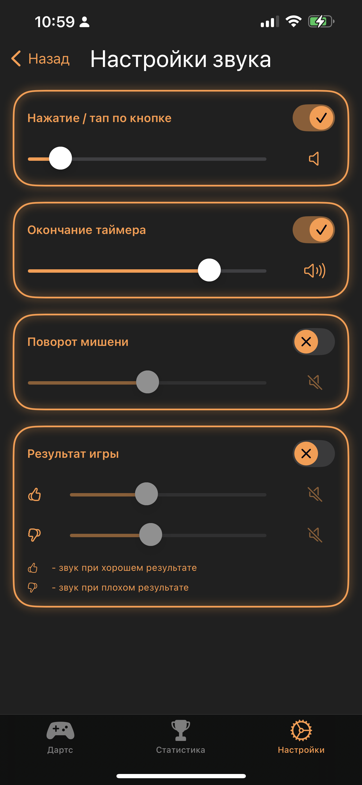
        

        

            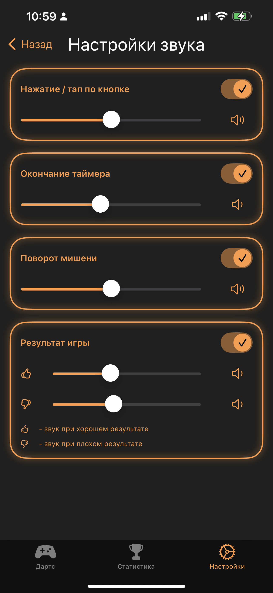
        

    

    

[statistics_06]: description/images/statistics_06.PNG
[statistics_05]: description/images/statistics_05.PNG
[statistics_04]: description/images/statistics_04.PNG
[statistics_03]: description/images/statistics_03.PNG
[statistics_02]: description/images/statistics_02.PNG
[statistics_01]: description/images/statistics_01.PNG
[settings_06]: description/images/settings_06.PNG
[settings_05]: description/images/settings_05.PNG
[settings_04]: description/images/settings_04.PNG
[settings_03]: description/images/settings_03.PNG
[settings_02]: description/images/settings_02.PNG
[settings_01]: description/images/settings_01.PNG
[games_05]: description/images/games_05.PNG
[games_04]: description/images/games_04.PNG
[games_03]: description/images/games_03.PNG
[games_02]: description/images/games_02.PNG
[games_01]: description/images/games_01.PNG
